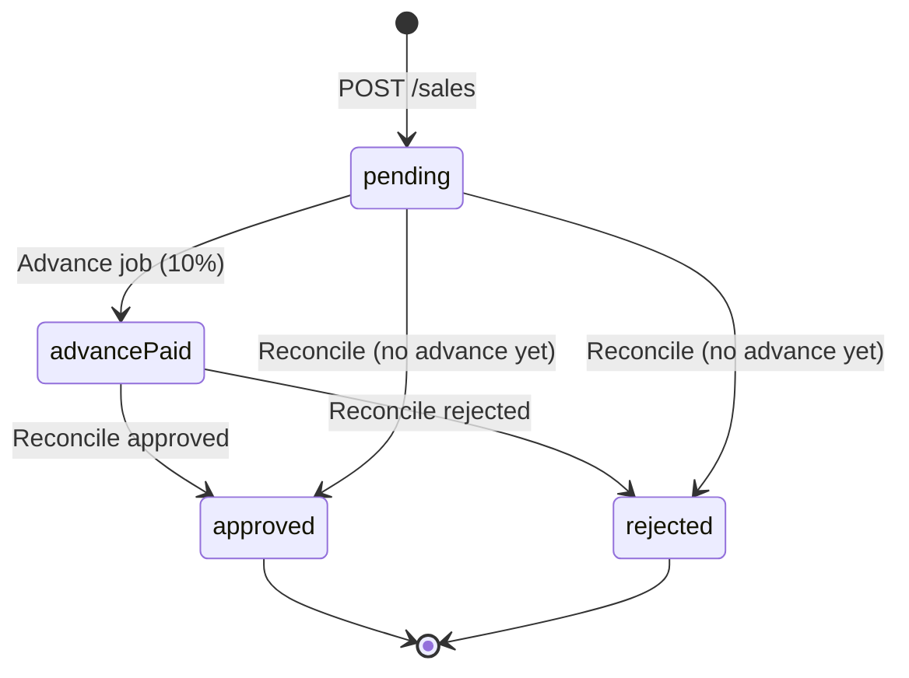
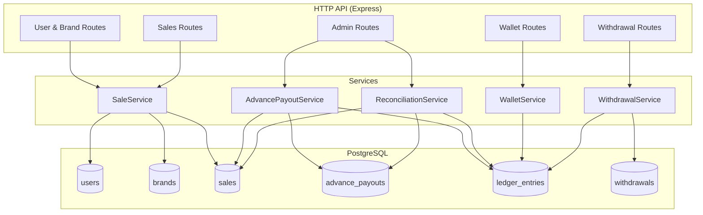
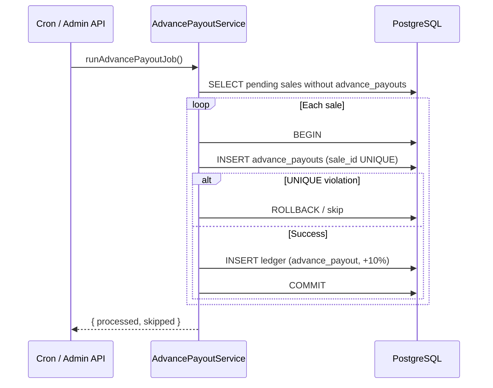
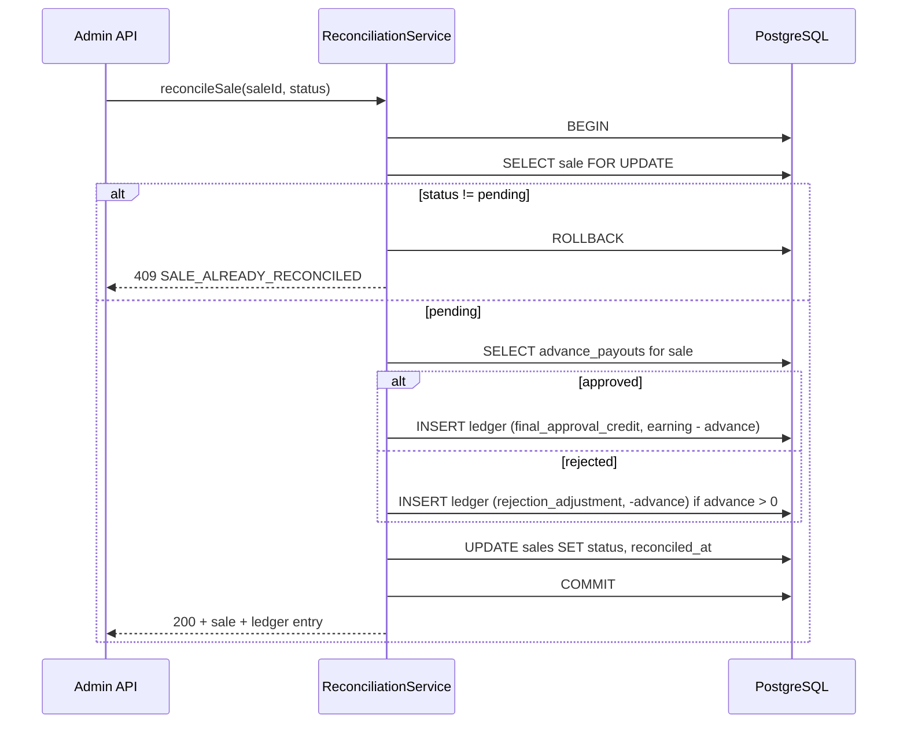
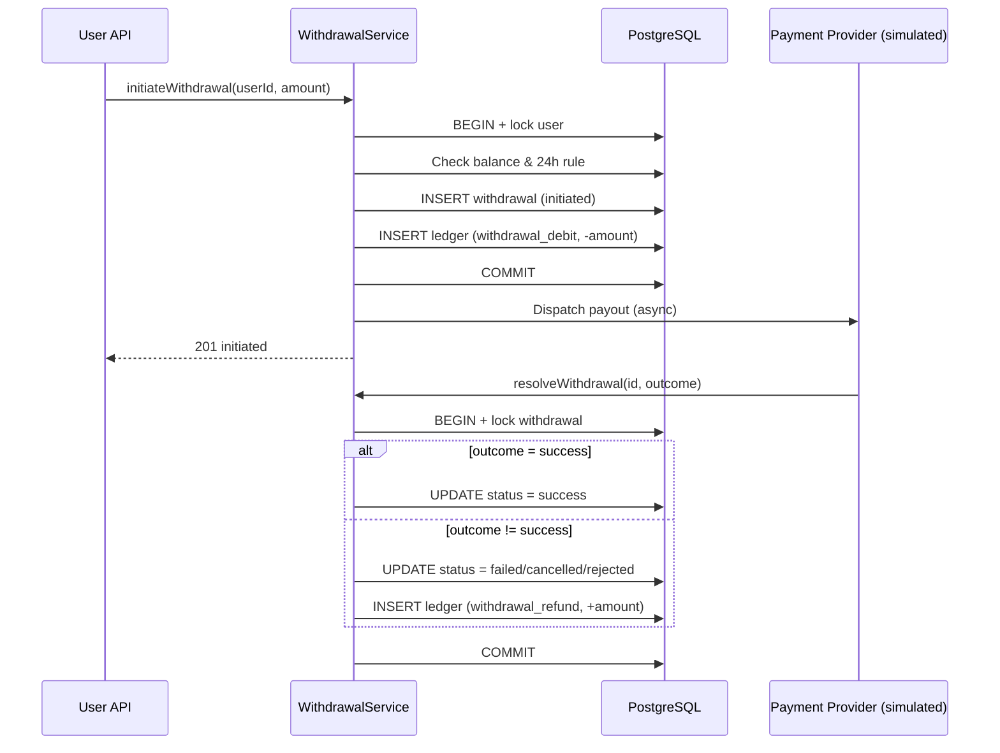

# User Payout Management System — Design Document

**Status:** Implemented  
**Stack:** Node.js + Express + PostgreSQL (`pg`, no ORM for ledger logic)  
**Currency:** Indian Rupees stored as integer **paise** (`BIGINT`); converted to ₹ only at API display boundaries

---

## Table of Contents

1. [Problem Statement](#1-problem-statement)
2. [Goals and Non-Goals](#2-goals-and-non-goals)
3. [Core Design Decision: Append-Only Ledger](#3-core-design-decision-append-only-ledger)
4. [System Overview](#4-system-overview)
5. [Database Schema](#5-database-schema)
6. [Money Rules and Calculations](#6-money-rules-and-calculations)
7. [Service Layer Design](#7-service-layer-design)
8. [API Specification](#8-api-specification)
9. [Process Flows](#9-process-flows)
10. [Concurrency, Idempotency, and Transactions](#10-concurrency-idempotency-and-transactions)
11. [Edge Cases and Error Handling](#11-edge-cases-and-error-handling)
12. [Reference Example (Assignment Fixture)](#12-reference-example-assignment-fixture)
13. [Testing Strategy](#13-testing-strategy)
14. [Future Enhancements](#14-future-enhancements)

---

## 1. Problem Statement

The system manages **user earnings from brand sales** through a multi-stage payout lifecycle:

1. A user records a **sale** (initially `pending`).
2. A scheduled **advance payout job** pays **10%** of each pending sale's earning upfront.
3. An admin **reconciles** each sale as `approved` or `rejected`, triggering a **final payout adjustment** that nets against any advance already paid.
4. Users **withdraw** their wallet balance subject to a **24-hour rate limit** between successful withdrawals.
5. Failed, cancelled, or rejected withdrawals are **refunded** back to the wallet.

Because this system handles **real money**, the design must prioritize:

| Concern | Why it matters |
|---|---|
| **Idempotency** | Cron jobs and webhooks retry; duplicate payouts are unacceptable |
| **Auditability** | Balance must be reconstructable months later with a full history |
| **Concurrency** | Parallel withdrawals, reconciliation, and job runs must not corrupt state |
| **Money semantics** | No floating-point errors; explicit handling of negative balances and rounding |

---

## 2. Goals and Non-Goals

### Goals

- Append-only **ledger** as the single source of truth for wallet balance
- Idempotent advance payout job (safe to re-run after partial failure)
- Atomic reconciliation with guard against double-processing
- Withdrawal with balance validation, 24h rate limit, and failed-payout recovery
- Full audit trail: every credit and debit is a persisted, typed ledger entry
- API suitable for manual testing (Postman) and automated integration tests

### Non-Goals (out of scope for v1)

- Authentication / authorization (admin endpoints are open; noted for production)
- Real payment provider integration (withdrawal resolution is simulated via webhook endpoint)
- Multi-currency support
- Distributed deployment across multiple app instances (Postgres row locks are sufficient for v1)
- UI / frontend

---

## 3. Core Design Decision: Append-Only Ledger

### What we reject

```sql
-- Anti-pattern: unauditable and unsafe under concurrency
UPDATE users SET wallet_balance = wallet_balance + $amount WHERE id = $userId;
```

Problems:

- **Lost updates** under concurrent writers (two threads read 100, both write 110 → one update lost)
- **No audit trail** — cannot answer "why is the balance ₹80?"
- **Failed payout recovery** requires fragile "undo" logic on a mutable field

### What we do instead

Every money movement is an immutable row in `ledger_entries`:

| Event | Ledger entry type | Sign |
|---|---|---|
| Advance payout (10% of sale) | `advance_payout` | `+` |
| Sale approved (net of advance) | `final_approval_credit` | `+` |
| Sale rejected (claw back advance) | `rejection_adjustment` | `-` |
| Withdrawal initiated | `withdrawal_debit` | `-` |
| Withdrawal failed/cancelled/rejected | `withdrawal_refund` | `+` |

**Balance is derived, never stored-and-mutated as the source of truth:**

```sql
SELECT COALESCE(SUM(amount_paise), 0) AS balance_paise
FROM ledger_entries
WHERE user_id = $1;
```

### Optional performance cache

For read-heavy workloads, a `users.cached_balance_paise` column may be updated **inside the same transaction** as each ledger insert. Rules:

- The ledger remains the **system of record**
- The cache is always **derivable** from ledger entries
- Cache is a performance optimization, not a correctness mechanism

---

## 4. System Overview

### Entities

```
users ──┬──< sales >── brands
        │
        ├──< advance_payouts (1:1 with sales that received advance)
        │
        ├──< ledger_entries (all money movements)
        │
        └──< withdrawals
```

### High-level lifecycle



### Component diagram



---

## 5. Database Schema

All monetary amounts use **`BIGINT` paise** (1 ₹ = 100 paise). Never use `FLOAT`/`DOUBLE` for money.

### 5.1 `users`

| Column | Type | Constraints | Description |
|---|---|---|---|
| `id` | `UUID` | PK, default `gen_random_uuid()` | Internal user ID |
| `external_id` | `TEXT` | UNIQUE, NOT NULL | Human-readable identifier (e.g. `john_doe`) |
| `cached_balance_paise` | `BIGINT` | NOT NULL, default `0` | Optional read cache; derivable from ledger |
| `created_at` | `TIMESTAMPTZ` | NOT NULL, default `now()` | Record creation time |

```sql
CREATE TABLE users (
  id                    UUID PRIMARY KEY DEFAULT gen_random_uuid(),
  external_id           TEXT UNIQUE NOT NULL,
  cached_balance_paise  BIGINT NOT NULL DEFAULT 0,
  created_at            TIMESTAMPTZ NOT NULL DEFAULT now()
);
```

### 5.2 `brands`

| Column | Type | Constraints | Description |
|---|---|---|---|
| `id` | `UUID` | PK | Internal brand ID |
| `name` | `TEXT` | UNIQUE, NOT NULL | Brand identifier (e.g. `brand_1`) |
| `created_at` | `TIMESTAMPTZ` | NOT NULL, default `now()` | Record creation time |

```sql
CREATE TABLE brands (
  id          UUID PRIMARY KEY DEFAULT gen_random_uuid(),
  name        TEXT UNIQUE NOT NULL,
  created_at  TIMESTAMPTZ NOT NULL DEFAULT now()
);
```

### 5.3 `sales`

| Column | Type | Constraints | Description |
|---|---|---|---|
| `id` | `UUID` | PK | Sale ID |
| `user_id` | `UUID` | FK → `users(id)`, NOT NULL | Earning owner |
| `brand_id` | `UUID` | FK → `brands(id)`, NOT NULL | Associated brand |
| `earning_paise` | `BIGINT` | NOT NULL, CHECK `>= 0` | Gross earning for this sale |
| `status` | `TEXT` | NOT NULL, default `'pending'` | `pending` \| `approved` \| `rejected` |
| `created_at` | `TIMESTAMPTZ` | NOT NULL, default `now()` | When sale was recorded |
| `reconciled_at` | `TIMESTAMPTZ` | NULL | Set when status leaves `pending` |

```sql
CREATE TABLE sales (
  id             UUID PRIMARY KEY DEFAULT gen_random_uuid(),
  user_id        UUID NOT NULL REFERENCES users(id),
  brand_id       UUID NOT NULL REFERENCES brands(id),
  earning_paise  BIGINT NOT NULL CHECK (earning_paise >= 0),
  status         TEXT NOT NULL DEFAULT 'pending'
                 CHECK (status IN ('pending', 'approved', 'rejected')),
  created_at     TIMESTAMPTZ NOT NULL DEFAULT now(),
  reconciled_at  TIMESTAMPTZ
);

CREATE INDEX idx_sales_user_status ON sales(user_id, status);
CREATE INDEX idx_sales_pending ON sales(status) WHERE status = 'pending';
```

**Notes:**

- Only `pending` sales are eligible for advance payout
- A sale transitions out of `pending` exactly once (enforced in application logic + status guard)

### 5.4 `advance_payouts`

One row per sale, **ever**. This table is the primary idempotency guard for the advance job.

| Column | Type | Constraints | Description |
|---|---|---|---|
| `id` | `UUID` | PK | Advance payout record ID |
| `sale_id` | `UUID` | FK → `sales(id)`, **UNIQUE**, NOT NULL | Ensures one advance per sale |
| `user_id` | `UUID` | FK → `users(id)`, NOT NULL | Denormalized for query convenience |
| `amount_paise` | `BIGINT` | NOT NULL, CHECK `> 0` | 10% of sale earning (see rounding rules) |
| `created_at` | `TIMESTAMPTZ` | NOT NULL, default `now()` | When advance was paid |

```sql
CREATE TABLE advance_payouts (
  id            UUID PRIMARY KEY DEFAULT gen_random_uuid(),
  sale_id       UUID NOT NULL UNIQUE REFERENCES sales(id),
  user_id       UUID NOT NULL REFERENCES users(id),
  amount_paise  BIGINT NOT NULL CHECK (amount_paise > 0),
  created_at    TIMESTAMPTZ NOT NULL DEFAULT now()
);

CREATE INDEX idx_advance_payouts_user ON advance_payouts(user_id);
```

### 5.5 `ledger_entries`

Append-only. **Source of truth** for wallet balance.

| Column | Type | Constraints | Description |
|---|---|---|---|
| `id` | `UUID` | PK | Ledger entry ID |
| `user_id` | `UUID` | FK → `users(id)`, NOT NULL | Affected user |
| `amount_paise` | `BIGINT` | NOT NULL | Signed: positive = credit, negative = debit |
| `entry_type` | `TEXT` | NOT NULL | See enum below |
| `reference_type` | `TEXT` | NOT NULL | `'sale'` or `'withdrawal'` |
| `reference_id` | `UUID` | NOT NULL | ID of the referenced sale or withdrawal |
| `created_at` | `TIMESTAMPTZ` | NOT NULL, default `now()` | Entry timestamp |

**`entry_type` enum:**

| Value | Direction | Trigger |
|---|---|---|
| `advance_payout` | Credit (+) | Advance job pays 10% |
| `final_approval_credit` | Credit (+) | Sale approved: `earning - advance` |
| `rejection_adjustment` | Debit (-) | Sale rejected: claw back advance |
| `withdrawal_debit` | Debit (-) | Withdrawal initiated |
| `withdrawal_refund` | Credit (+) | Withdrawal failed/cancelled/rejected |

```sql
CREATE TABLE ledger_entries (
  id             UUID PRIMARY KEY DEFAULT gen_random_uuid(),
  user_id        UUID NOT NULL REFERENCES users(id),
  amount_paise   BIGINT NOT NULL,
  entry_type     TEXT NOT NULL CHECK (entry_type IN (
                   'advance_payout',
                   'final_approval_credit',
                   'rejection_adjustment',
                   'withdrawal_debit',
                   'withdrawal_refund'
                 )),
  reference_type TEXT NOT NULL CHECK (reference_type IN ('sale', 'withdrawal')),
  reference_id   UUID NOT NULL,
  created_at     TIMESTAMPTZ NOT NULL DEFAULT now()
);

CREATE INDEX idx_ledger_user_created ON ledger_entries(user_id, created_at DESC);

-- Prevents duplicate ledger entries for the same event (idempotency)
CREATE UNIQUE INDEX uq_ledger_ref
  ON ledger_entries(reference_type, reference_id, entry_type);
```

**Invariant:** For any given `(reference_type, reference_id, entry_type)` tuple, at most one ledger row may exist.

### 5.6 `withdrawals`

| Column | Type | Constraints | Description |
|---|---|---|---|
| `id` | `UUID` | PK | Withdrawal ID |
| `user_id` | `UUID` | FK → `users(id)`, NOT NULL | Requesting user |
| `amount_paise` | `BIGINT` | NOT NULL, CHECK `> 0` | Requested withdrawal amount |
| `status` | `TEXT` | NOT NULL, default `'initiated'` | See enum below |
| `created_at` | `TIMESTAMPTZ` | NOT NULL, default `now()` | Request time |
| `resolved_at` | `TIMESTAMPTZ` | NULL | When terminal status was set |

**`status` enum:** `initiated` → `success` | `failed` | `cancelled` | `rejected`

```sql
CREATE TABLE withdrawals (
  id            UUID PRIMARY KEY DEFAULT gen_random_uuid(),
  user_id       UUID NOT NULL REFERENCES users(id),
  amount_paise  BIGINT NOT NULL CHECK (amount_paise > 0),
  status        TEXT NOT NULL DEFAULT 'initiated'
                CHECK (status IN ('initiated', 'success', 'failed', 'cancelled', 'rejected')),
  created_at    TIMESTAMPTZ NOT NULL DEFAULT now(),
  resolved_at   TIMESTAMPTZ
);

CREATE INDEX idx_withdrawals_user_created ON withdrawals(user_id, created_at DESC);
CREATE INDEX idx_withdrawals_user_success ON withdrawals(user_id, resolved_at DESC)
  WHERE status = 'success';
```

### 5.7 Entity Relationship Diagram

```mermaid
erDiagram
    users ||--o{ sales : owns
    brands ||--o{ sales : has
    sales ||--o| advance_payouts : "receives (0..1)"
    users ||--o{ ledger_entries : has
    users ||--o{ withdrawals : requests
    sales ||--o{ ledger_entries : "referenced by"
    withdrawals ||--o{ ledger_entries : "referenced by"

    users {
        uuid id PK
        text external_id UK
        bigint cached_balance_paise
        timestamptz created_at
    }

    brands {
        uuid id PK
        text name UK
        timestamptz created_at
    }

    sales {
        uuid id PK
        uuid user_id FK
        uuid brand_id FK
        bigint earning_paise
        text status
        timestamptz created_at
        timestamptz reconciled_at
    }

    advance_payouts {
        uuid id PK
        uuid sale_id FK_UK
        uuid user_id FK
        bigint amount_paise
        timestamptz created_at
    }

    ledger_entries {
        uuid id PK
        uuid user_id FK
        bigint amount_paise
        text entry_type
        text reference_type
        uuid reference_id
        timestamptz created_at
    }

    withdrawals {
        uuid id PK
        uuid user_id FK
        bigint amount_paise
        text status
        timestamptz created_at
        timestamptz resolved_at
    }
```

---

## 6. Money Rules and Calculations

### 6.1 Storage and display

| Layer | Format | Example |
|---|---|---|
| Database | Integer paise (`BIGINT`) | `4000` |
| API request/response (internal) | Integer paise | `"amountPaise": 4000` |
| API display (optional helper field) | Rupees as string/decimal | `"amountRupee": "40.00"` |

**Never** use JavaScript `Number` floating point for arithmetic on money. All calculations happen in integer paise.

### 6.2 Advance payout (10%)

```
advance_paise = FLOOR(earning_paise * 10 / 100)
```

For the assignment fixture (₹40 = 4000 paise each):

```
advance = FLOOR(4000 * 10 / 100) = 400 paise = ₹4
```

**Rounding policy:** Floor toward zero. Document explicitly so graders and future engineers know the rule. Alternative (`ROUND`) is acceptable if stated; floor is conservative for the platform.

**Minimum earning:** If `advance_paise` computes to `0` (earning < ₹0.10), skip creating an advance payout for that sale (no zero-amount ledger entries).

### 6.3 Reconciliation — approved

```
final_credit_paise = earning_paise - advance_paise_already_paid
```

If no advance was paid yet, `advance_paise_already_paid = 0`, so full earning is credited.

Ledger entry: `+final_credit_paise`, type `final_approval_credit`, reference `(sale, sale_id)`.

### 6.4 Reconciliation — rejected

```
clawback_paise = advance_paise_already_paid
```

If no advance was paid, no clawback ledger entry is created (amount = 0).

Ledger entry: `-clawback_paise`, type `rejection_adjustment`, reference `(sale, sale_id)`.

### 6.5 Withdrawal

- **Initiate:** debit wallet immediately (`withdrawal_debit`, `-amount_paise`)
- **Success:** no additional ledger entry (debit stands)
- **Failed / cancelled / rejected:** credit back (`withdrawal_refund`, `+amount_paise`)

### 6.6 Negative balances

If a rejection clawback exceeds the user's current balance, **the balance is allowed to go negative**. This is intentional:

- The user received an advance they must net against future earnings
- Blocking reconciliation because of insufficient balance would leave sales stuck in `pending`
- Negative balance self-corrects as new sales are approved

---

## 7. Service Layer Design

Controllers remain thin; all business rules live in services for independent unit testing.

```
SaleService
├── createSale(userId, brandId, earningPaise) → Sale
├── getSaleById(saleId) → Sale
└── getPendingSalesForUser(userId) → Sale[]

AdvancePayoutService
└── runAdvancePayoutJob() → { processed, skipped, errors }
    For each sale WHERE status = 'pending' AND no advance_payouts row:
      BEGIN (per-sale transaction)
        INSERT advance_payouts
        INSERT ledger_entries (advance_payout, +amount)
        [UPDATE users.cached_balance_paise if caching enabled]
      COMMIT
    On UNIQUE violation → skip (already processed)

ReconciliationService
└── reconcileSale(saleId, newStatus: 'approved' | 'rejected') → Sale
    BEGIN
      SELECT sale FOR UPDATE
      IF sale.status != 'pending' → throw ConflictError
      advance = lookup advance_payouts for sale (default 0)
      IF approved:
        INSERT ledger (final_approval_credit, +(earning - advance))
      IF rejected AND advance > 0:
        INSERT ledger (rejection_adjustment, -advance)
      UPDATE sales SET status, reconciled_at = now()
    COMMIT

WalletService
├── getBalance(userId) → { balancePaise, balanceRupee }
└── getLedgerHistory(userId, pagination) → LedgerEntry[]

WithdrawalService
├── initiateWithdrawal(userId, amountPaise) → Withdrawal
│   BEGIN
│     Acquire user lock (FOR UPDATE or advisory lock)
│     Validate amount > 0
│     Validate amount <= current balance
│     Validate 24h rule (last SUCCESSFUL withdrawal)
│     INSERT withdrawals (initiated)
│     INSERT ledger (withdrawal_debit, -amount)
│   COMMIT
│   [Async: dispatch to payment provider]
│
└── resolveWithdrawal(withdrawalId, outcome) → Withdrawal
    BEGIN
      SELECT withdrawal FOR UPDATE
      IF withdrawal.status != 'initiated' → idempotent no-op or 409
      UPDATE withdrawals SET status, resolved_at
      IF outcome != 'success':
        INSERT ledger (withdrawal_refund, +amount)  -- idempotent via unique index
    COMMIT
```

---

## 8. API Specification

Base URL: `/api/v1` (prefix optional; consistent across implementation)

All timestamps: ISO 8601 UTC (`2026-07-18T08:00:00Z`).

### 8.1 Common conventions

**Success responses:** JSON body with resource data.

**Error responses:**

```json
{
  "error": "ERROR_CODE",
  "message": "Human-readable description",
  "details": {}
}
```

| HTTP Status | When |
|---|---|
| `200` | Successful GET, successful idempotent replay |
| `201` | Resource created |
| `400` | Validation error (bad input, insufficient balance) |
| `404` | Resource not found |
| `409` | Conflict (already reconciled, duplicate operation) |
| `429` | Rate limited (24h withdrawal rule) |
| `500` | Unexpected server error |

---

### 8.2 `POST /users`

Create a user.

**Request body:**

```json
{
  "externalId": "john_doe"
}
```

**Response `201`:**

```json
{
  "id": "uuid",
  "externalId": "john_doe",
  "balancePaise": 0,
  "createdAt": "2026-07-18T08:00:00Z"
}
```

**Errors:**

| Code | Status | Condition |
|---|---|---|
| `VALIDATION_ERROR` | 400 | Missing or empty `externalId` |
| `DUPLICATE_USER` | 409 | `externalId` already exists |

---

### 8.3 `POST /brands`

Create a brand.

**Request body:**

```json
{
  "name": "brand_1"
}
```

**Response `201`:**

```json
{
  "id": "uuid",
  "name": "brand_1",
  "createdAt": "2026-07-18T08:00:00Z"
}
```

**Errors:**

| Code | Status | Condition |
|---|---|---|
| `VALIDATION_ERROR` | 400 | Missing or empty `name` |
| `DUPLICATE_BRAND` | 409 | Brand name already exists |

---

### 8.4 `POST /sales`

Record a new sale. Status defaults to `pending`.

**Request body:**

```json
{
  "userId": "uuid",
  "brandId": "uuid",
  "earningPaise": 4000
}
```

**Response `201`:**

```json
{
  "id": "uuid",
  "userId": "uuid",
  "brandId": "uuid",
  "earningPaise": 4000,
  "earningRupee": "40.00",
  "status": "pending",
  "createdAt": "2026-07-18T08:00:00Z",
  "reconciledAt": null
}
```

**Errors:**

| Code | Status | Condition |
|---|---|---|
| `VALIDATION_ERROR` | 400 | Missing fields, `earningPaise < 0` |
| `USER_NOT_FOUND` | 404 | Invalid `userId` |
| `BRAND_NOT_FOUND` | 404 | Invalid `brandId` |

---

### 8.5 `POST /admin/advance-payout-job/run`

Manually trigger the batch advance payout job. Intended to also run on a cron schedule (e.g. every hour).

**Request body:** none

**Response `200`:**

```json
{
  "processed": 3,
  "skipped": 0,
  "errors": [],
  "totalAdvancePaidPaise": 1200
}
```

**Behavior:**

- Selects all `sales` with `status = 'pending'` that have **no** corresponding `advance_payouts` row
- For each sale: computes 10% advance, inserts `advance_payouts` + `ledger_entries` atomically
- Safe to call repeatedly (idempotent via `UNIQUE(sale_id)` on `advance_payouts`)
- Each sale processed in its own transaction so one failure does not roll back the entire batch

**Errors:**

| Code | Status | Condition |
|---|---|---|
| `JOB_PARTIAL_FAILURE` | 200 with errors array | Some sales failed; others committed |

Individual sale errors appear in `errors[]`:

```json
{
  "saleId": "uuid",
  "error": "description"
}
```

---

### 8.6 `POST /admin/sales/:saleId/reconcile`

Reconcile a pending sale as approved or rejected.

**Request body:**

```json
{
  "status": "approved"
}
```

Allowed values: `"approved"` | `"rejected"`

**Response `200`:**

```json
{
  "sale": {
    "id": "uuid",
    "userId": "uuid",
    "brandId": "uuid",
    "earningPaise": 4000,
    "status": "approved",
    "reconciledAt": "2026-07-18T10:00:00Z"
  },
  "ledgerEntry": {
    "id": "uuid",
    "entryType": "final_approval_credit",
    "amountPaise": 3600,
    "amountRupee": "36.00"
  },
  "userBalancePaise": 8000
}
```

For rejection, `ledgerEntry.entryType` = `rejection_adjustment`, `amountPaise` is negative.

**Errors:**

| Code | Status | Condition |
|---|---|---|
| `SALE_NOT_FOUND` | 404 | Invalid `saleId` |
| `VALIDATION_ERROR` | 400 | Invalid status value |
| `SALE_ALREADY_RECONCILED` | 409 | Sale is not `pending` |

---

### 8.7 `GET /users/:userId/balance`

Return the user's current withdrawable balance.

**Response `200`:**

```json
{
  "userId": "uuid",
  "balancePaise": 8000,
  "balanceRupee": "80.00"
}
```

**Errors:**

| Code | Status | Condition |
|---|---|---|
| `USER_NOT_FOUND` | 404 | Invalid `userId` |

---

### 8.8 `GET /users/:userId/ledger`

Paginated ledger history (newest first).

**Query parameters:**

| Param | Type | Default | Description |
|---|---|---|---|
| `limit` | integer | 50 | Max entries (cap at 100) |
| `offset` | integer | 0 | Pagination offset |

**Response `200`:**

```json
{
  "userId": "uuid",
  "entries": [
    {
      "id": "uuid",
      "amountPaise": 3600,
      "amountRupee": "36.00",
      "entryType": "final_approval_credit",
      "referenceType": "sale",
      "referenceId": "uuid",
      "createdAt": "2026-07-18T10:00:00Z"
    }
  ],
  "pagination": {
    "limit": 50,
    "offset": 0,
    "total": 6
  }
}
```

---

### 8.9 `POST /users/:userId/withdrawals`

Initiate a withdrawal.

**Request body:**

```json
{
  "amountPaise": 5000
}
```

**Response `201`:**

```json
{
  "id": "uuid",
  "userId": "uuid",
  "amountPaise": 5000,
  "amountRupee": "50.00",
  "status": "initiated",
  "createdAt": "2026-07-18T12:00:00Z"
}
```

**Validation rules:**

1. `amountPaise > 0`
2. `amountPaise <= current balance`
3. No **successful** withdrawal in the last 24 hours (see §11)

**Errors:**

| Code | Status | Condition |
|---|---|---|
| `USER_NOT_FOUND` | 404 | Invalid `userId` |
| `VALIDATION_ERROR` | 400 | Invalid amount |
| `INSUFFICIENT_BALANCE` | 400 | Amount exceeds balance |
| `WITHDRAWAL_RATE_LIMITED` | 429 | 24h rule violated |

**Rate limit response `429`:**

```json
{
  "error": "WITHDRAWAL_RATE_LIMITED",
  "message": "Only one withdrawal is allowed every 24 hours.",
  "nextEligibleAt": "2026-07-19T10:15:00Z",
  "lastSuccessfulWithdrawalAt": "2026-07-18T10:15:00Z"
}
```

---

### 8.10 `POST /withdrawals/:withdrawalId/resolve`

Simulates a payment provider webhook. Resolves an `initiated` withdrawal.

**Request body:**

```json
{
  "outcome": "success"
}
```

Allowed values: `"success"` | `"failed"` | `"cancelled"` | `"rejected"`

**Response `200`:**

```json
{
  "id": "uuid",
  "status": "success",
  "resolvedAt": "2026-07-18T12:05:00Z",
  "refundIssued": false
}
```

For non-success outcomes:

```json
{
  "id": "uuid",
  "status": "failed",
  "resolvedAt": "2026-07-18T12:05:00Z",
  "refundIssued": true,
  "refundLedgerEntryId": "uuid"
}
```

**Errors:**

| Code | Status | Condition |
|---|---|---|
| `WITHDRAWAL_NOT_FOUND` | 404 | Invalid ID |
| `VALIDATION_ERROR` | 400 | Invalid outcome |
| `WITHDRAWAL_ALREADY_RESOLVED` | 409 | Not in `initiated` state (unless idempotent replay of same outcome) |

**Idempotency:** If the same outcome is posted again for an already-resolved withdrawal, return `200` with current state (no double refund).

---

### 8.11 API Summary Table

| Method | Endpoint | Purpose |
|---|---|---|
| `POST` | `/users` | Create user |
| `POST` | `/brands` | Create brand |
| `POST` | `/sales` | Create sale (`pending`) |
| `POST` | `/admin/advance-payout-job/run` | Run advance payout batch job |
| `POST` | `/admin/sales/:saleId/reconcile` | Approve or reject a sale |
| `GET` | `/users/:userId/balance` | Current wallet balance |
| `GET` | `/users/:userId/ledger` | Paginated transaction history |
| `POST` | `/users/:userId/withdrawals` | Initiate withdrawal |
| `POST` | `/withdrawals/:withdrawalId/resolve` | Resolve withdrawal (webhook simulator) |

---

## 9. Process Flows

### 9.1 Advance payout job



### 9.2 Reconciliation



### 9.3 Withdrawal lifecycle



---

## 10. Concurrency, Idempotency, and Transactions

### 10.1 Idempotency mechanisms

| Operation | Mechanism | Layer |
|---|---|---|
| Advance payout per sale | `UNIQUE(sale_id)` on `advance_payouts` | Database |
| Ledger entry per event | `UNIQUE(reference_type, reference_id, entry_type)` | Database |
| Advance job re-run | Skip sales that already have `advance_payouts` row | Application + DB |
| Reconciliation | Status guard (`pending` only) + `FOR UPDATE` | Application + DB |
| Withdrawal resolve webhook | Status guard + unique ledger index for refund | Application + DB |

**Principle:** Database constraints are the last line of defense. Application checks alone race under concurrency.

### 10.2 Locking strategy

| Scenario | Lock |
|---|---|
| Reconciliation of a sale | `SELECT ... FROM sales WHERE id = $1 FOR UPDATE` |
| Withdrawal initiation | `SELECT ... FROM users WHERE id = $1 FOR UPDATE` or `pg_advisory_xact_lock(hashtext(user_id))` |
| Withdrawal resolution | `SELECT ... FROM withdrawals WHERE id = $1 FOR UPDATE` |
| Advance job + reconciliation on same sale | Sale row lock during reconciliation; advance insert uses UNIQUE constraint |

### 10.3 Transaction boundaries

| Operation | Transaction scope |
|---|---|
| Advance payout (per sale) | Single sale: `advance_payouts` + `ledger_entries` + optional cache update |
| Reconciliation | Single sale: ledger insert + sale status update |
| Withdrawal initiate | Balance check + withdrawal insert + ledger debit |
| Withdrawal resolve | Status update + optional refund ledger entry |
| Advance job (batch) | **Not** one big transaction — one transaction per sale |

### 10.4 Advance job crash recovery

If the job crashes after processing 5,000 of 10,000 sales:

- 5,000 `advance_payouts` rows are committed
- Re-run processes only the remaining 5,000
- No separate job progress table required

---

## 11. Edge Cases and Error Handling

Each case below must be handled explicitly in implementation and tested.

### 11.1 Advance payout

| # | Edge case | Expected behavior |
|---|---|---|
| A1 | **Job re-run** | No duplicate payouts. `UNIQUE(sale_id)` on `advance_payouts` rejects second insert; sale is skipped. |
| A2 | **Concurrent job instances** | Two workers race on same sale; one wins INSERT, other gets UNIQUE violation and skips. |
| A3 | **Sale reconciled before advance job runs** | Advance job only selects `status = 'pending'`. Reconciled sales are excluded. |
| A4 | **Earning too small for 10%** | If `FLOOR(earning * 0.10) = 0`, skip advance (no row, no ledger entry). |
| A5 | **Job crash mid-batch** | Re-run is safe; already-processed sales are skipped. |

### 11.2 Reconciliation

| # | Edge case | Expected behavior |
|---|---|---|
| R1 | **Double reconciliation** | Return `409 SALE_ALREADY_RECONCILED`. Sale must leave `pending` exactly once. |
| R2 | **Concurrent reconciliation requests** | `FOR UPDATE` on sale row; second request sees non-pending status → 409. |
| R3 | **Reconcile with no prior advance** | `advance = 0`. Approved: credit full `earning_paise`. Rejected: no clawback entry. |
| R4 | **Rejection clawback > balance** | Allow negative balance. Document as intentional (nets against future earnings). |
| R5 | **Reconcile while advance job running** | Possible race: if advance completes first, reconciliation uses actual advance. If reconciliation wins first (sale no longer pending), advance job skips sale. Correct in both orderings. |

### 11.3 Withdrawals

| # | Edge case | Expected behavior |
|---|---|---|
| W1 | **Insufficient balance** | Reject with `400 INSUFFICIENT_BALANCE`. |
| W2 | **Concurrent withdrawal requests** | User-level lock ensures only one passes balance check at a time. |
| W3 | **24h rate limit** | Only **successful** withdrawals count. Query: `MAX(resolved_at) WHERE status = 'success' AND resolved_at > now() - 24h`. |
| W4 | **Failed withdrawal and 24h window** | Failed/cancelled/rejected withdrawals do **not** consume the 24h window. User may retry immediately after refund. |
| W5 | **Withdrawal fails after debit** | `withdrawal_refund` ledger entry restores balance. |
| W6 | **Duplicate webhook (same outcome)** | Idempotent: return current state, no second refund. |
| W7 | **Duplicate webhook (different outcome)** | Reject `409` — cannot change terminal state (or define explicit reversal policy; default: reject). |
| W8 | **Withdraw full balance then reconcile** | Balance already reflects all ledger entries; withdrawal debits current computed balance. |
| W9 | **Zero or negative amount** | Reject `400 VALIDATION_ERROR`. |

### 11.4 Data integrity

| # | Edge case | Expected behavior |
|---|---|---|
| D1 | **Float in API input** | Reject non-integer `amountPaise` / `earningPaise`. |
| D2 | **Missing foreign keys** | Return `404` for invalid user/brand/sale references. |
| D3 | **Duplicate external_id / brand name** | Return `409`. |

### 11.5 24-hour rule — explicit policy

**Rule:** A user may have at most one **successful** withdrawal per rolling 24-hour window.

**Implementation:**

```sql
SELECT resolved_at
FROM withdrawals
WHERE user_id = $1
  AND status = 'success'
ORDER BY resolved_at DESC
LIMIT 1;
```

If `resolved_at > now() - interval '24 hours'`, reject with `429` and include `nextEligibleAt = resolved_at + 24 hours`.

**Trade-off (documented):** Basing the window on successful withdrawals only means a user who initiates 10 failed withdrawals in an hour is not rate-limited. A production system might add a separate abuse limit on **attempts**; v1 prioritizes fairness when the payment provider fails.

---

## 12. Reference Example (Assignment Fixture)

This trace must pass as an automated test.

### Setup

- 1 user
- 3 pending sales, each `earning_paise = 4000` (₹40)
- Total pending earnings: ₹120

### Step 1: Advance payout job

| Sale | Earning | Advance (10%) | Ledger entry |
|---|---|---|---|
| Sale 1 | ₹40 | ₹4 (400 paise) | `+400` advance_payout |
| Sale 2 | ₹40 | ₹4 | `+400` advance_payout |
| Sale 3 | ₹40 | ₹4 | `+400` advance_payout |

**Total advance paid:** ₹12 (1200 paise)  
**Balance after advance:** ₹12

### Step 2: Reconciliation

| Sale | Outcome | Calculation | Ledger entry | Type |
|---|---|---|---|---|
| Sale 1 | Rejected | clawback ₹4 | `-400` | rejection_adjustment |
| Sale 2 | Approved | ₹40 − ₹4 = ₹36 | `+3600` | final_approval_credit |
| Sale 3 | Approved | ₹40 − ₹4 = ₹36 | `+3600` | final_approval_credit |

**Reconciliation delta (Final Payout):** −4 + 36 + 36 = **₹68** (6800 paise)

This ₹68 is the *incremental* payout at reconciliation time, separate from the ₹12 advance already paid.

### Final balance

```
Balance = advance credits + reconciliation entries
        = (+400 + 400 + 400) + (-400 + 3600 + 3600)
        = 1200 + 6800
        = 8000 paise
        = ₹80
```

**Verification against real earnings:** ₹0 (rejected) + ₹40 + ₹40 = **₹80** ✓

### Ledger chronology (6 entries)

| # | Type | Amount (paise) | Running balance (paise) |
|---|---|---|---|
| 1 | advance_payout (sale 1) | +400 | 400 |
| 2 | advance_payout (sale 2) | +400 | 800 |
| 3 | advance_payout (sale 3) | +400 | 1200 |
| 4 | rejection_adjustment (sale 1) | −400 | 800 |
| 5 | final_approval_credit (sale 2) | +3600 | 4400 |
| 6 | final_approval_credit (sale 3) | +3600 | 8000 |

---

## 13. Testing Strategy

### Unit tests (services)

- Advance calculation with floor rounding
- Reconciliation formulas (with and without prior advance)
- 24h rule based on successful withdrawals only
- Negative balance after rejection clawback

### Integration tests (API + DB)

- **PDF fixture end-to-end:** 3 sales → advance job → reconcile → assert balance ₹80 and reconciliation delta ₹68
- Advance job idempotency: run twice, assert no duplicate ledger entries
- Double reconciliation returns 409
- Concurrent withdrawal simulation (sequential strictness test with locks)
- Failed withdrawal refunds balance and does not block next attempt within 24h
- Duplicate resolve webhook does not double-refund

### Test data conventions

- Use integer paise in all fixtures
- Fixed UUIDs optional for deterministic assertions

---

## 14. Future Enhancements

If this were production-bound, the following would be next:

| Enhancement | Rationale |
|---|---|
| **Distributed locking** (Redis / advisory locks across instances) | Multi-instance deployment without double-processing |
| **Job queue** (Bull, SQS) for advance payouts | Scale beyond single-batch cron |
| **Partition `ledger_entries`** by `user_id` or time | Query performance at millions of rows |
| **Admin audit log** with actor attribution | Compliance for reconciliation actions |
| **Rate limiting on withdrawal attempts** | Abuse prevention alongside 24h success rule |
| **AuthN/AuthZ** | Protect admin endpoints |
| **Outbox pattern** for payment provider dispatch | Reliable async withdrawal processing |
| **Reconciliation reversal** workflow | Handle admin mistakes with compensating entries |
| **DECIMAL(12,2)** alternative | Equally valid; document driver behavior if switching |

---

## Appendix: Design Trade-offs Summary

| Decision | Choice | Alternative rejected | Reason |
|---|---|---|---|
| Balance storage | Append-only ledger | Mutable `wallet_balance` column | Auditability, idempotency, concurrency safety |
| Money type | Integer paise (`BIGINT`) | Float / JavaScript Number | Precision |
| Advance idempotency | `UNIQUE(sale_id)` on `advance_payouts` | App-only check | Race-safe |
| Negative balance | Allowed | Block reconciliation | Unblocks ops; nets against future earnings |
| 24h withdrawal window | Based on last **success** | Based on last attempt | Fairness when provider fails |
| Withdrawal debit timing | Immediate on initiate | Debit on success only | Prevents double-spend; refund on failure |
| Batch job transactions | Per-sale | Single batch transaction | Partial failure recovery without rollback of entire job |

---

*This document is the implementation blueprint. Code, migrations, and tests follow in subsequent phases.*
